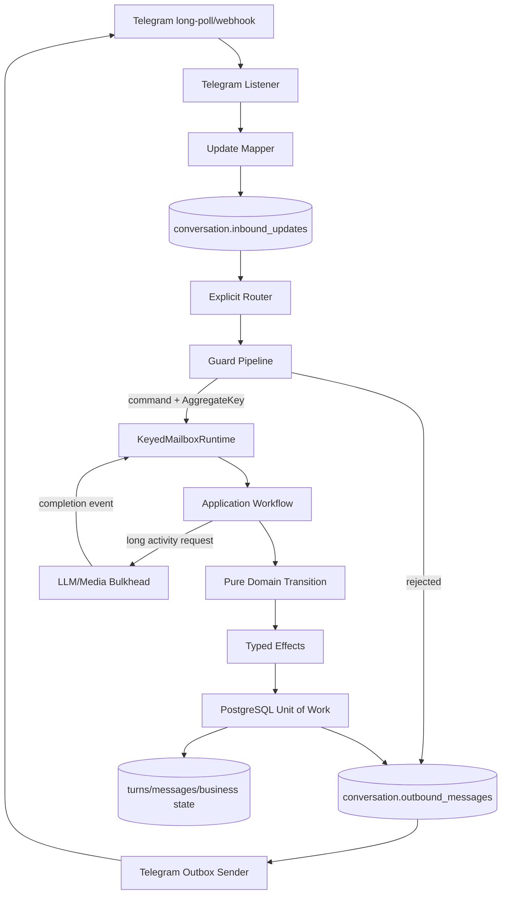
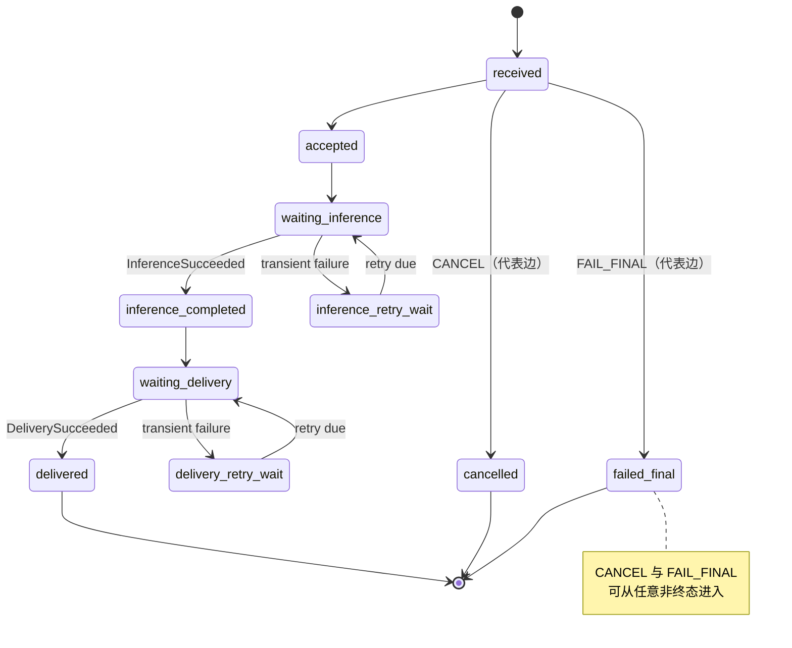

# FogMoe Bot 运行时架构与重构蓝图

> 状态：Architecture Decision Record（ADR，架构决策记录）、实现说明与剩余风险清单。
> 审计基线：2026-07-11，重构开始前的 Git `HEAD`；实现状态更新于 2026-07-14。
> 运行环境：Python 3.14、PostgreSQL、python-telegram-bot（PTB）。

生产 profiling 的采样公式、dbctl/Dashboard 排障顺序、事务归因、复测方法与本轮案例见
[运行时 Profiling、诊断与优化 Runbook](runtime-profiling.md)。

## 1. 范围与约束

本文处理的不是一次目录美化，而是执行模型的替换。现有功能语义——Telegram 命令、账户与经济规则、AI 对话、群管理、游戏、媒体和定时任务——需要保留；旧模块、旧函数签名、同步 facade（门面）和进程内状态布局不构成兼容契约，可以直接删除。

目标约束如下：

1. 继续使用 `src-layout` 与单部署单元内的 layered architecture（分层架构）。PyPA 指出 `src-layout` 可以防止测试和运行时意外导入工作目录中的未安装副本，故保留 `src/fogmoe_bot` 与独立的 `src/fogmoe_dbctl`。[PyPA: src layout vs flat layout](https://packaging.python.org/en/latest/discussions/src-layout-vs-flat-layout/)
2. Telegram 是输入/输出适配器，不是业务运行时；PTB handler 不拥有业务状态和事务。
3. 同一聚合（Aggregate）严格串行，不同聚合有界并发；资源并发与业务顺序是两个不同控制面。
4. 业务事实、正在执行的长工作流以及待投递消息必须可恢复；缓存才允许只存在于内存。
5. 数据库事务不得等待 Telegram、LLM、HTTP、文件下载或线程池结果。
6. 用 Python 3.14 类型系统表达身份、状态和结果；`dict[str, Any]` 仅允许停留在第三方协议边界。
7. 不保留能执行旧余额逻辑的兼容层。迁移完成时删除旧入口、callback、锁和 facade；未在当前正式命令表中声明的命令由单一 durable 拒绝路由处理，绝不回落到旧实现。

### 1.1 当前迁移状态（2026-07-14）

| 切片 | 当前状态 | 已建立的不变量 |
|---|---|---|
| `KeyedMailboxRuntime` + `BotRuntime` | 已落地 | 同 key FIFO、跨 key 有界并发；一个 `TaskGroup`；按 ingress→acceptance→inference→outbox 分阶段关停 |
| durable listener/inbox | 已成为唯一生产入口 | 自控 `getUpdates`；完整批次落盘前不推进 offset；inbox lease/fencing/head-of-line |
| Turn/message/inference activity/outbox | 已落地并接入生产 | UUIDv5 幂等 identity；短事务；lease/fencing；成功时 history+outbox 原子提交 |
| Telegram outbox sender | 已接入生产 `BotRuntime` | delivery stream 有序；at-least-once；Retry-After/full jitter；模糊成功显式建模 |
| scheduling | 已接入生产 `BotRuntime` | 已删除 daemon thread、第二 event loop、第二 Bot、第二 DB engine 和专属 inference executor |
| verification | 已落地 | durable OCC aggregate 与 lease/fencing worker 分属 service/worker 模块；无 JobQueue/模块锁/detached task；超额 claim batch fail-closed |
| 互动玩法 | 已落地 | 既有轻量玩法保持各自不可混用的 command/result 类型与窄 service/port；新建的可验证随机活动、个人冒险与群组小镇见下方独立限界上下文 |
| Accounts / Economy | 已落地 | registration/lottery/gift/check-in 等**当前公开**金币流动使用短事务、稳定 receipt 与银行 posting；`bank.account_balances` 是唯一金额 source of truth。0062 已删除 `identity.users` 的余额/方案镜像及投影 guard |
| Bank | 已落地 | `bank` 以 append-only、平衡双重记账（double-entry ledger）管理 `Free` 与 `Paid legacy` 两个不可互换钱包；申请、审批、发行和余额投影均有幂等回执与数据库约束 |
| Billing / Entitlements | 已落地 | `billing` 只记录受控原生支付的订单、付款事件、退款、权益和订阅；没有金币金额、汇率或支付→金币转换字段/依赖 |
| Town / Personal RPG / Chance | 已落地 | `/town` 是群组范围，`/adventure` 是私聊个人范围；`/chance` 使用 Free-only、commit–reveal 和持久化原子结算 |
| Assistant Agent + Tool Effects | 已落地并接入 durable inference | provider-neutral async completion port；Telegram Assistant 请求直接接受，不携带金币价格或旧预留状态；step checkpoint 先于 tool；读写均有 receipt；写操作与业务事实/媒体 outbox 原子提交 |
| `/tl` Translation | 已并入 durable Conversation workflow | `/tl` 直接创建 durable turn，不读取或写入金币余额；专用 prompt、禁用工具；翻译输入/输出永久排除出 Assistant 历史；旧 sync task runner 已删除 |
| BTC monitor | 已落地 | 主 `BotRuntime` 所有；同步 SDK 经通用 bulkhead 限制并发、排队和响应预算，超时线程退出前不释放 slot |
| Blocking SDK lifecycle | 已落地 | Assistant 的 external/media/sticker bulkhead 由组合根显式创建；上游 worker 停止后关闭 admission 并等待已开始线程，再停 Outbox/PTB；supervisor 失败取消也会先 drain 已开始线程 |
| Admin announcements | 已落地 | 统计读投影与公告写 workflow 为独立 adapter；受众快照、lease/fencing、durable fan-out、outbox 完成报告；无逐用户 sleep/direct-send loop |
| Moderation | 已落地 | group aggregate/OCC + toggle receipt、effect + warning window、report dedup 分属三个窄 adapter；无进程全局业务锁 |
| Context Window / Retrieval / User Profile | 已拆分 | `context_window` 只拥有 token-aware projection、checkpoint 与 lease/fencing compaction；`retrieval` 从 Conversation 形成可追溯 Passage 并执行租户隔离的语义召回；User Profile 保留独立扩展位；旧 Memory quota、schema 与 records 已删除 |
| 群消息投影 | 已落地 | `(group_id,message_id)` canonical 幂等投影；编辑按 `update_id` 防陈旧覆盖；Assistant/Admin 只读新投影 |
| Media picture / music | 已落地 | `/pic` 是免费随机预览，不读取或写入金币、报价或收费 receipt；系统不提供 HD 购买或付费图片 callback。Picture/Music 分别拥有 service、runtime、port、HTTP/DB adapter 与 Telegram handler，不再经过 Media 总门面 |
| Assistant Telegram route | 已落地 | durable primary route、typed Update/request mapping 与 PTB JSON strict parser 分属三个模块；旧 mega route 与 root re-export 已删除 |
| 未声明 Telegram 命令 | 已落地 | 单一 durable 拒绝路由在 Assistant 前返回 `/help` 指引；它不枚举、不保留任何历史命令名，也不读取或写入经济状态 |
| 其余 Telegram feature adapters | 显式 catalog 边界 | 26 个互斥 catalog primary 已由 durable inbox + keyed runtime 调度；银行、账单和活动命令由同一 durable command route 独占；部分 UI 回复仍是 Telegram at-least-once 直发，是剩余投递风险而非第二入口 |

### 1.2 已知保证边界

- Telegram 没有通用幂等键；网络模糊成功仍可能造成重复消息，outbox 提供的是可恢复的
  at-least-once（至少一次）投递，不宣称 exactly-once（恰好一次）。
- Inbox 与 Scheduling 没有 lease heartbeat（租约心跳）；极慢 handler 超过 lease 时，正确性依赖
  业务幂等键和 finalize fencing，而不是假设只会有一个进程。
- 未声明的历史命令、拼写错误和未来删除的命令都由同一拒绝路由返回当前帮助；没有迁移提示 handler、旧聚合读取或兼容执行路径。
- `bank` 是当前公开金币流动的唯一 source of truth；0062 在核对 Bank 权威余额及旧 plan 权益证据后，已删除 `identity.users.coins` / `coins_paid` / `user_plan` 镜像和投影 guard。0054 的不可变 Bank 账本分录保留了历史审计证据；0058 已删除旧 Assistant 预留表、其触发器和无操作赠币表。当前 Assistant 与 `/tl` 不读取或写入余额。
- Python 不能强制终止已开始的同步 SDK 线程；bulkhead 会一直占用 slot 到线程真实退出，避免超时
  风暴突破容量；正常关停和 supervisor 取消都会显式等待这些线程，但取消延迟仍受第三方 SDK
  控制，超出全局 grace 期由进程管理器升级。
- `BotRuntime` 的 drain 没有内建截止时间；进程组合根以全局 grace period 包裹它，超时后升级为
  cancel。

### 1.3 银行、支付与活动的分域决策（2026-07-14）

这次切片不把“金币”“付款”“订阅”和“游戏”塞进一个万能 Economy service。它们的失败模式、审计要求和可逆性不同，故采用下列互斥且覆盖完整的边界：

| 限界上下文 | 拥有的事实 | 允许的资金/状态流 | 明确禁止的耦合 |
|---|---|---|---|
| `bank` | 账户、余额投影、不可变账本分录、代币申请、操作回执 | `Free` 的发行、转移、群贡献、活动托管/派彩；历史 `Paid legacy` 的独立保留 | 不读取支付金额，不持有报价/订阅，不把两个钱包合并或互换 |
| `billing` | 产品、报价、订单、经验证付款事件、退款、履约、权益、订阅 | 受控原生支付事件 → 已付款订单 → 权益/订阅 | 不调用银行，不写金币，不保存兑换率，也不接受用户自报付款成功 |
| `personal_rpg` | 个人角色、每日探索、材料、制作和收藏 | 仅 `PersonalScope(user_id)` 的个人进度演化 | 不接受群聊 ID、`TownScope` 或群金库作为角色/库存所有者 |
| `town` | 群小镇、项目、成员贡献和群金库语义 | 群成员的 `Free` → 对应 `TownScope(group_id)` 金库/项目 | 不读取个人 RPG 角色、材料或 `Paid legacy` |
| `chance` | 轮次承诺、客户端种子、证明、结果和结算回执 | 仅 `Free` 押注与 `Free` 派彩；私聊或群聊的显式 round scope | 不接收 `Paid legacy`，不使用隐藏赔率，也不通过“先出结果后承诺”决定随机数 |

`/recharge` 仅保留为 `/request_tokens <数量> <用途>` 的申请简写；它不再表示手工充值、卡密兑换或人工确认付款。`$FOGMOE` 买入、兑换和 swap 不在系统边界内。历史命令不被显式占有或兼容；只要不在当前命令表中声明，就会被拒绝路由统一返回 `/help`。`/pic` 则只提供免费随机预览，系统不提供 HD 购买。对于支付渠道，本文只要求“受控且经验证的原生支付事件”；这不是 Telegram Stars 已在任何部署自动启用的声明。

银行的 source-of-truth 承诺由数据库与应用共同强制：任何可见金币变化必须是平衡的 Bank posting；`identity.users` 只投影该结果，直接写入会失败。运行时数据库角色仍应遵循最小权限（least privilege）与变更审计，因为拥有任意 SQL 执行权的受信进程本身不属于应用层触发器能够隔离的攻击者。

#### 1.3.1 可验证随机活动的种子保密边界

`chance.rounds.server_seed` 是承诺阶段唯一尚未公开的秘密（secret）。数据库状态约束会要求它只存在于 `committed` 行，并在 `settled` 时清空；公开读取模型、Telegram 文案和回执都不得返回它。这个设计能证明**已结算**结果与先前 Commitment 相符，但它不能自动抵御持有数据库秘密读取权限的操作者：若某个报表、调试工具、共享数据库账号、慢查询日志或备份在结算前泄露 `server_seed`，持有者可在客户端种子提交后预先计算结果，并选择性制造失败、延迟或人工干预。这样的可选择性中止（selective abort）已经破坏了“运营方不能在开奖后挑结果”的可信承诺，即使账本仍然平衡。

因此上线时把 `server_seed` 当作支付密钥同等级别的敏感数据，而不是普通业务列：

1. 为迁移、机器人运行时、只读报表分别使用不同 PostgreSQL 角色；`fogmoe-dbctl` 的迁移角色绝不作为机器人连接账号，也不向日常运维人员共享。
2. 只让负责 `PostgresChanceRoundOperations.bind_and_settle_chance_round` 的受控机器人运行时账号拥有 `chance.rounds.server_seed` 的列级读取权限；所有报表、客服、管理后台和临时 SQL 账号显式 `REVOKE SELECT (server_seed)`。它们只能读取不含该列的安全字段，最好经一个不投影 `server_seed` 的只读 view（视图）。
3. 该秘密读取账号不应拥有 `SUPERUSER`、`CREATEDB`、`CREATEROLE`、任意 schema 的 `CREATE` 或无关表的宽泛权限；连接串只存于部署 secret，查询日志、异常日志、慢查询采样和数据库备份也不得记录或向非受信任者开放种子字节。
4. 保持现有的短事务、锁定行后再读取种子、幂等回执和 committed → settled 单向转换；当奖池不足或任何校验失败时，在**读取/揭示结果之前**返回确定性失败，不能用“重抽”或更换种子恢复。

这是一条明确的威胁模型边界：数据库超级用户、获得机器人进程内存或该受控账号凭据的攻击者仍可看到未揭示种子；仅靠 PostgreSQL ACL（访问控制列表）不能防住这些主体。若未来需要把该主体也排除在外，应另行评估独立结算服务、外部密钥管理（KMS）或硬件安全模块（HSM）；当前版本不把这些基础设施引入运行时，而要求先完成上述最小权限与日志/备份隔离。

## 2. 重构前基线：系统实际如何运行

本节是 2026-07-11 的审计快照，不是当前包目录；其中部分路径已在后续切片中物理删除。

### 2.1 导入图

对 `src/fogmoe_bot/**/*.py` 做 AST 级静态扫描，解析相对导入、包重导出和模块导入；基线包含 160 个 Python 模块、395 次项目内导入、394 条唯一的有向模块边，未发现强连通分量大于 1 的静态 import cycle（导入环）。无静态环并不表示边界健康：边的方向暴露了更直接的问题。

| 来源层 | 目标层 | 唯一边数 | 判断 |
|---|---:|---:|---|
| `application` | `application` | 130 | 功能之间横向耦合过多 |
| `application` | `domain` | 34 | 合法 |
| `application` | `infrastructure` | 85 | 现状可运行，目标终态禁止直接依赖具体 adapter |
| `domain` | `domain` | 57 | 合法 |
| `domain` | `infrastructure` | 20 | 明确反向依赖，必须归零 |
| `infrastructure` | `domain` | 7 | adapter 实现 domain port，合法 |
| `infrastructure` | `infrastructure` | 26 | 合法，但需避免万能工具包 |
| `presentation` | `application` | 29 | 合法方向，但当前导入的是 Telegram-aware 应用模块 |
| `presentation` | `infrastructure` | 1 | 应由 composition root（组合根）注入 |

基线中的 20 条 `domain → infrastructure` 边全部来自旧工具目录：工具从 domain 直接读取配置、创建 `requests.Session`、访问数据库 repository 和网络代理。该目录现已删除；纯 catalog 位于 `application/assistant/tools`，async orchestration 位于 `application/assistant/tool_runtime.py`，HTTP、PostgreSQL、文件与 provider SDK 均由 infrastructure adapter 经窄 port 注入。

高扇出和高扇入节点进一步说明“万能入口”问题：

| 节点 | 唯一边数 | 风险 |
|---|---:|---|
| ~~`presentation.telegram.handler_groups`~~ | 原 fan-out 26 | 已由单一不可变 `handler_catalog.py` 取代 |
| `application.telegram.bot_conversation` | fan-out 23 | 单文件同时拥有批处理、计费、持久化、推理和投递 |
| `application.assistant.prompt_job_handler` | fan-out 17 | 调度任务重建了一套对话执行路径 |
| ~~`infrastructure.database.connection`~~ | 原 fan-in 34 | 已删除；typed SQL primitive 并入唯一 engine/UoW owner `database.db` |
| ~~`infrastructure.config`~~ | 原 fan-in 29 | 已删除；配置现在由各可执行程序的组合根读取并显式注入 |
| `application.telegram.command_cooldown` | fan-in 26 | 横切策略以全局函数渗入所有功能 |
| `application.accounts.service` | fan-in 24 | sync/async facade、规则和 repository delegation 混合 |

项目内部导入图还漏掉了一类更大的层间泄漏：32 个 `application` 文件直接 import `telegram`，5 个直接 import `sqlalchemy`，3 个直接 import `aiohttp`。旧 `handler_groups.py` 曾从大量应用模块导入 Telegram callback，而这些模块又通过 `setup_*` 自行注册 handler；自注册现已删除并集中到 `handler_catalog.py`，但 callback 本身仍需继续从 application 下沉到 presentation adapter。

现有边界测试 [test_domain_dependencies.py](../tests/test_domain_dependencies.py) 只禁止 `domain → application`，没有禁止 `domain → infrastructure` 和 domain 的第三方 I/O 依赖；[test_package_boundaries.py](../tests/test_package_boundaries.py) 主要依赖路径存在性与字符串搜索，不能证明完整依赖规则。目标测试必须解析 AST 或使用 import-graph 工具，验证所有项目内边和第三方 allow-list。

### 2.2 Handler 注册与隐式路由

[bot_app.py](../src/fogmoe_bot/presentation/telegram/bot_app.py) 使用 `.concurrent_updates(True)`。PTB 中 `True` 等价于最多 256 个 update 并发；官方同时警告，有状态处理若隐式依赖顺序就不应直接开启并发，并要求并发数、HTTP connection pool 和 pool timeout 联合设计。[PTB ApplicationBuilder](https://docs.python-telegram-bot.org/en/stable/telegram.ext.applicationbuilder.html)

[handler_catalog.py](../src/fogmoe_bot/presentation/telegram/handler_catalog.py) 当前显式声明正式 catalog 边界的 26 个 handler；银行、Billing、个人冒险、小镇与随机活动由 durable command route 单独拥有，未声明命令则由单一拒绝 route 处理。durable conversation router 独占 Assistant candidates，不再把 Assistant `reply` handler 注册到 PTB catalog：

| Handler 类型 | 数量 |
|---|---:|
| `CommandHandler` | 16 |
| `CallbackQueryHandler` | 7 |
| `MessageHandler` | 2 |
| `ChatMemberHandler` | 1 |

26 个定义都是互斥 namespace 的 primary；catalog 构造时拒绝重复 command 和 callback namespace。guard 与 observer 已由 application router 的类型化阶段承载，catalog 不再保留永不匹配的 role/group 抽象。所有定义由 durable inbox dispatcher 消费，不注册到 PTB `Application` 形成第二条更新入口。[PTB Application.add_handler](https://docs.python-telegram-bot.org/en/stable/telegram.ext.application.html#telegram.ext.Application.add_handler)

当前隐式 pipeline 是：

```text
durable ingress guards
  -> 一个 primary route（专用 durable route 或 26 项 catalog 的互斥匹配）
  -> durable observers
```

这带来三种不可局部推断的行为：

- 新增 handler 可能仅因注册位置改变已有命令；
- guard、主命令与 observer 的“能否继续”由 PTB 异常和 group 约定表达；
- 256 个并发 update 在进入同一个有状态 handler 后，再由各模块自己的锁重新串行。

目标 router 必须把这些语义改成类型化、显式阶段：`ingress middleware → guards → primary command → domain events → observers`。一个 update 只能产生一个 primary command，但可以产生零到多个 observer event；observer 不得借 PTB group 改变主流程。

### 2.3 全局可变状态与状态所有权缺失

以下不是穷举常量，而是所有重要的进程级可变业务状态类别：

| 类别 | 当前证据 | 问题 | 目标所有者 |
|---|---|---|---|
| 对话批次与互斥 | [bot_conversation.py](../src/fogmoe_bot/application/telegram/bot_conversation.py) 的 `_MESSAGE_BATCHES`；[conversation_lock_manager.py](../src/fogmoe_bot/application/conversation_lock_manager.py) | batch key 是 `(chat_id,user_id)`，锁 key 却是 `user_id`；无容量上限 | `KeyedMailboxRuntime` + durable turn |
| AI 上下文缓存 | [conversation_context_cache.py](../src/fogmoe_bot/application/assistant/conversation_context_cache.py) 的全局 singleton | 无统一生命周期、版本和多实例一致性 | runtime-owned versioned cache |
| 账户/经济锁 | `accounts/service.py:lottery_locks`、`charge_coin.py:code_locks`、`ref.py:processing_invitations`、`shop.py`/`stake_coin.py` 全局锁 | 只能保护单进程，且锁粒度与数据库事务不一致 | account aggregate + DB constraints/row locks |
| 游戏会话 | `rockpaperscissors_game.py:active_games/game_locks/game_timeouts`、`sicbo.py:active_games`、RPG cooldown dict | 重启即丢失，任务缺少 owner | game aggregate；交互中的游戏 durable |
| Crypto 任务 | `crypto_predict.py:user_locks/active_predict_tasks/button_click_cooldown`、`bot_monitoring.py:monitor_thread` | fire-and-forget Task 与用户状态交织 | scheduled job / workflow aggregate |
| 媒体状态 | `pic.py` 的多组 cache/set/semaphore；`music.py` 的 request/cache/rate-limit dict | 缓存、幂等和工作中状态无法区分 | cache service + media work record + bulkhead |
| 审核状态 | `keyword_handler.py` 与 `spam_control.py` 的 dict/defaultdict + `threading.Lock` | 在 event loop 中使用线程锁；策略缓存和速率限制混合 | group aggregate + TTL cache + admission policy |
| 验证状态 | `member_verify.py:_verification_locks` 与 PTB JobQueue | DB 有 task，执行所有权仍在进程锁和 timer | durable verification workflow |
| 工具产物 | `assistant/tools/image_tools.py`、`voice_tools.py` 的 generated-file dict；sandbox/sticker cache | 文件生命周期由跨模块 `pop_*` 协议表达 | `ArtifactStore` 与 artifact ID |
| 冷却/限流 | `command_cooldown.py` 及各功能自己的 dict | 时间源、容量、清理和 key 各自定义 | runtime policy / rate-limit port |

审计到的可变名称清单如下；同一行中的名称具有相同迁移目的。纯常量 catalog（例如 payout table、tool schema、provider alias）不计为业务状态，但目标代码仍应优先使用 tuple/frozenset/只读映射，避免“全大写 dict”被意外修改。

| 当前文件 | 可变进程状态/资源 |
|---|---|
| `application/accounts/service.py` | `lottery_locks` |
| `application/assistant/conversation_context_cache.py` | `CONVERSATION_CONTEXT_CACHE` singleton |
| `application/assistant/inference/service.py` | `ASSISTANT_INFERENCE_SERVICE` 持有 provider circuit 状态 |
| `application/assistant/tasks/summary.py` | `_SUMMARY_EXECUTOR` |
| `application/assistant/tasks/translate.py` | `translate_limiter` |
| `application/assistant/tools/runtime.py` | `DEFAULT_AGENT_RUNTIME` 及其 pending task map |
| `application/assistant/tools/image_tools.py` | `_GENERATED_IMAGE_FILES`、`_IMAGE_RATE_LIMITS` 及两把 thread lock |
| `application/assistant/tools/voice_tools.py` | `_GENERATED_AUDIO_FILES`、`_VOICE_RATE_LIMITS` 及两把 thread lock |
| `application/assistant/tools/sandbox_tools.py` | `_ACTIVE_SANDBOX_USER_IDS`、`_USER_SANDBOX_CREATE_COOLDOWNS`、lock |
| `application/assistant/tools/sticker_tools.py` | `_STICKER_SET_CACHE`、`_CACHE_LOCK` |
| `application/assistant/tools/memory_tools.py` | `_GROUP_CONTEXT_BOT_ID` |
| `application/chat/group_chat_history.py` | `_bot_user_id` |
| `application/crypto/bot_monitoring.py` | `CHAT_ID`、`monitor_thread`、`executor`、`lock_until` |
| `application/crypto/chart.py` | `token_cache`、`cache_timestamps` |
| `application/crypto/crypto_predict.py` | `user_locks`、`active_predict_tasks`、`button_click_cooldown` |
| `application/economy/ref.py` | `processing_invitations`、`processing_lock` |
| `application/economy/shop.py` | global `lock`、`scratch_records`、`huanle_records`、`last_lottery_messages` |
| `application/economy/stake_coin.py` | global `lock` |
| `application/games/gamble.py` | `gamble_game`、`gamble_lock` |
| `application/games/omikuji.py` | `omikuji_locks` |
| `application/games/rockpaperscissors_game.py` | `active_games`、`waiting_room`、`waiting_room_lock`、`game_locks`、`game_timeouts` |
| `application/games/sicbo.py` | `active_games`、`game_locks` |
| `application/games/rpg/battles.py`、`monsters.py`、`utils.py` | 两组 cooldown dict、`rpg_db_executor` |
| `application/media/music.py` | `PROCESSING_REQUESTS`、`RESULTS_CACHE`、`USER_RATE_LIMITS`、`USER_COOLDOWNS` |
| `application/media/pic.py` | `IMAGE_CACHE`、`FORBIDDEN_API_UNTIL`、`HD_IMAGE_CACHE`、`request_semaphore`、`USER_HD_REQUESTS`、`IMAGE_REQUESTERS`、`PROCESSING_IMAGES`、`USER_HELP_RECORDS`、`USER_RECENT_IMAGES`、`RECENT_SENT_IMAGES` |
| `application/moderation/keyword_handler.py` | `keyword_cache`、`rate_limiter`、两把 thread lock |
| `application/moderation/member_verify.py` | `_verification_locks` |
| `application/moderation/spam_control.py` | `warning_rate_limiter`、`callback_cooldown`、两把 thread lock |
| `application/telegram/bot_commands.py` | `last_rich_query_time` |
| `application/telegram/bot_conversation.py` | `_BOT_ID/_BOT_USERNAME`、`_MESSAGE_BATCHES`、`_MESSAGE_BATCHES_LOCK` |
| `application/telegram/command_cooldown.py` | `command_cooldowns`、`chat_cooldowns`、`cooldown_lock` |
| `infrastructure/database/db.py` | loop→engine weak map、`_ENGINE_LOCK`、`_DEFAULT_MAIN_LOOP`、bound-loop ContextVar |
| `infrastructure/logging/bot_logging.py` | listener/handler/current path/atexit lifecycle globals |

模块全局只允许两类值：真正不可变的常量，以及 composition root 创建并显式注入、具有 `start()/close()` 生命周期的进程资源。任何可变业务事实都不允许以模块 dict、set、Task 或 lock 形式存在。

### 2.4 同步阻塞 I/O 与并发预算碎片化

系统不是单线程串行，而是存在多套互不知情的并发机制：

| 当前机制 | 容量/行为 | 风险 |
|---|---:|---|
| PTB `.concurrent_updates(True)` | 256 | 与 DB、LLM、Telegram pool 不匹配 |
| assistant blocking executor | 旧 domain-owned executor 为 10；迁移中改由 `application/assistant/blocking.py` 所有 | `ThreadPoolExecutor` 提交队列无业务 backpressure |
| summary executor | 2 | `submit()` 后无 durable owner，关停和失败不可见 |
| BTC monitoring executor | 1 | 另有全局 Task；`delayed_check_result()` 直接调用同步 Binance SDK |
| RPG DB executor | 5 | async DB 已存在，线程池是多余桥接 |
| scheduling runtime | 独立 daemon thread、event loop、DB engine、Telegram Bot、inference executor | 形成第二个应用实例和第二套生命周期 |

阻塞边界的完整类别审计：

| 类别 | 当前路径 | Event-loop 影响 |
|---|---|---|
| 同步 `requests` | `application/assistant/tools/{code,http,image,sticker,voice}_tools.py` | 当前通常随整个 agent loop 进入 assistant executor；仍缺少 tool-kind 独立容量，且 application 绑定 transport |
| 同步 LiteLLM completion | `infrastructure/llm/litellm_client.py`，由 `application/assistant/agent_loop.py` 调用 | 整个 agent turn 占用一条 blocking worker，provider 慢调用会挤压所有同步工具 |
| 同步 Binance SDK + `time.sleep` retry | `infrastructure/crypto/biance_api.py` | monitor 主检查被 offload；`bot_monitoring.delayed_check_result()` 却直接在 async function 调 `check_result()`，会阻塞主 loop |
| sync→async DB bridge | `accounts/service.py`、assistant memory/schedule/user tools、summary、group history 曾调用旧 `run_sync()` bridge | worker 用 `run_coroutine_threadsafe(...).result()` 等待 event loop；形成隐藏的跨线程同步依赖 |
| sync→async Telegram bridge | `application/telegram/assistant_visible_sender.py` | inference worker 同步等待主 loop 发送消息；投递延迟占住 LLM worker |
| 无 owner 的 background submit/task | summary `executor.submit()`、monitor/prediction/RPS 的 `asyncio.create_task()` | 异常、取消、shutdown 和重启恢复不完整 |
| polling bootstrap `time.sleep` | `presentation/telegram/bot_app.py` | 发生在 `run_polling()` 退出后的同步控制流，不直接堵塞正在运行的 loop；仍应改为统一 async lifecycle/backoff |
| async `aiohttp` | media `pic.py`/`music.py`、moderation `sf.py` | 不阻塞 loop，但 client/proxy/retry/cache 位于错误层且各自实现 |

[AssistantInferenceService](../src/fogmoe_bot/application/assistant/inference/service.py) 把同步 LLM + tool loop 整体放入线程池，避免直接堵塞 event loop，但工具又通过 [assistant_visible_sender.py](../src/fogmoe_bot/application/telegram/assistant_visible_sender.py) 的 `run_coroutine_threadsafe(...).result()` 回投主 loop；同步工具通过 [db.py](../src/fogmoe_bot/infrastructure/database/db.py) 的 `run_sync()` 再回投 DB coroutine。这个“event loop → worker thread → event loop → worker thread 等待”的桥接提高了死锁、线程饥饿和 shutdown 卡死的组合复杂度。

Python 3.14 的 asyncio 本来就适合 I/O-bound 并发；一个 event loop 可以在 I/O await 时运行其他 Task，线程池只应容纳无法替换的同步 SDK，CPU-bound 工作应进入独立 process pool 或经过实测后使用 free-threaded build，而不应把业务会话等同于线程。[Python 3.14 asyncio](https://docs.python.org/3.14/library/asyncio.html)

### 2.5 对话状态机并不 durable

[ConversationTurnSession](../src/fogmoe_bot/application/telegram/bot_conversation.py) 把一次调用标记为：

```text
BATCHED → VALIDATED → GATED → PRICED → CHARGED → PREPARED
→ USER_PERSISTED → INFERRED → OUTPUT_PERSISTED → DELIVERED → COMPLETED
```

它比无结构的函数更清楚，但仍是内存中的 transaction script（事务脚本）：

- 状态随进程退出消失，无法从 `INFERRED` 或 `WAITING_DELIVERY` 恢复；
- transition method 自己执行 DB、LLM、Telegram 和媒体副作用，无法纯测试或 replay；
- `FAILED` 不记录失败阶段、重试时刻、attempt 或补偿动作；
- 全程持有用户锁，慢 LLM 和 Telegram 投递造成同用户 head-of-line blocking（队首阻塞）；
- `conversation_id = user_id`，而消息 batch key 为 `(chat_id,user_id)`，身份语义隐藏在裸 `int` 中。

尤其严重的是 `_charge_and_load_user_state()` 在数据库 transaction 内执行 `message.reply_text()`（未注册或余额不足分支）。网络抖动会延长账户行锁。扣费提交后若媒体分析、LLM 或 Telegram 失败，也没有 reservation/settlement（预留/结算）状态。

### 2.6 JSONB read-modify-write 会丢更新

已删除的 `connection.py` 曾由 `insert_chat_records()` 在 transaction 中执行：

```text
SELECT messages
→ Python 解码整个 JSON 数组
→ append/trim/token count
→ UPDATE 整个 messages JSONB
```

读取没有 `FOR UPDATE` 或 version predicate。两个并发事务都可能读取相同旧值并让后提交者覆盖先提交者。进程锁无法保护后台摘要、调度线程、多进程部署或遗漏的调用路径。与此同时，消息数越多，每次写放大越大，也无法通过 `(source_update_id, ordinal)` 唯一约束实现消息级幂等。

PostgreSQL 文档说明 `SELECT ... FOR UPDATE` 会对选中行加锁；`SKIP LOCKED` 适合多个 consumer 竞争 queue-like table，但它产生不一致视图，不应用于普通查询。[PostgreSQL SELECT locking](https://www.postgresql.org/docs/current/sql-select.html)

### 2.7 结构问题优先级

| 优先级 | 结构问题 | 为什么排在这里 |
|---:|---|---|
| 1 | 没有 durable inbox/turn/outbox，DB 与 Telegram/LLM 是无恢复协议的 dual write | 进程在任一 await/commit 边界退出都会造成漏 update、重复副作用或永久卡住 |
| 2 | transaction 内等待 Telegram，且 AI 费用直接扣除而非 reservation | 外部延迟扩大账户锁；失败后的钱和业务状态无法自动收敛 |
| 3 | Conversation identity、batch key、lock key、group history key 不一致 | 顺序和记忆范围是隐藏语义，跨群阻塞及历史串线无法从类型看出 |
| 4 | JSONB chat history 是未加行锁/version 的整行 read-modify-write | 已存在 lost-update 条件，且写放大随历史增长 |
| 5 | 长 LLM/tool/delivery 持有整个用户锁 | 同用户队首阻塞、无法取消/补充、等待 Task 无界增长 |
| 6 | 256 PTB 并发、多套线程池、DB pool 和模块 semaphore 没有统一容量模型 | 系统已并发却没有 backpressure，过载时首先放大下游故障 |
| 7 | domain→infrastructure 反向依赖，application 大面积绑定 Telegram/SQLAlchemy/HTTP | 无法独立测试、替换 adapter 或用类型证明业务边界 |
| 8 | 60 个 handler 的主路由依赖 group 与注册顺序 | 新功能会非局部改变旧行为，guard/observer 语义不可见 |
| 9 | scheduling 建立第二线程、event loop、DB engine 和 Bot；sync bridge 在 loop/thread 间往返 | 生命周期、关停、context propagation 和资源预算成倍复杂 |
| 10 | 全局 dict/lock/Task/cache 同时承载事实、工作中状态和缓存 | 重启语义与多实例语义不确定，也无法统一清理、观测和限流 |

## 3. 设计原则与类型策略

### 3.1 对象的职责

采用聚合而不是“每个函数一个 class”或万能 `BotRuntime`：

- **Domain aggregate**：拥有业务状态转换和不变量，不执行 I/O。
- **Application service/workflow**：加载 aggregate、调用 transition、执行或排队 effect、提交 Unit of Work（工作单元）。
- **Port**：仅为数据库、Telegram、LLM、时钟、ID、artifact 等真实不稳定边界定义；不为每个纯函数制造接口。
- **Infrastructure adapter**：实现 port，包含 SQL、SDK、HTTP、文件系统和 vendor error translation。
- **Presentation adapter**：把 Telegram `Update` 转成内部 command，把内部 view 转成 Telegram payload。
- **Composition root**：只在 `main.py` 创建 settings、engine、client、runtime、router 和 worker，并管理它们的生命周期。

DDD（Domain-Driven Design，领域驱动设计）的生产实践要求 aggregate root 成为不变量的唯一入口，domain 不依赖数据访问框架。[Microsoft: DDD-oriented service](https://learn.microsoft.com/en-us/dotnet/architecture/microservices/microservice-ddd-cqrs-patterns/ddd-oriented-microservice)

### 3.2 Python 3.14 类型规则

1. 所有身份使用不可混用的值类型：`ConversationId`、`TurnId`、`UpdateId`、`UserId`、`ChatId`、`OutboundMessageId`。单纯静态区分可用 `NewType`；需要格式校验、序列化或方法时使用 `@dataclass(frozen=True, slots=True)` wrapper。Python 官方说明 `NewType` 可在几乎无运行时成本下阻止把普通 `int` 误传给特定 ID。[Python 3.14 typing](https://docs.python.org/3.14/library/typing.html#newtype)
2. command、event、effect 和 result 使用 frozen/slotted dataclass 的 discriminated union（可判别联合），不用字符串 `type` + `dict[str, Any]`。
3. 使用 Python 3.14 `type` statement 定义真正等价的 alias；需要不等价身份时禁止用 alias 冒充新类型。
4. port 使用小型 `Protocol` structural typing（结构化类型），不建立 `BaseRepository`、`BaseService` 等贫血继承树。
5. `match` 处理封闭状态/事件联合，并在默认分支调用 `typing.assert_never()`；启用 strict type checking 与 `warn_unreachable`，让新增状态而未处理成为构建错误。
6. Pydantic 仅在 Telegram/HTTP/config/LLM payload 边界做运行时解析；解析成功立即转换成 domain value object。
7. 时间统一为 UTC-aware `datetime`；重试等待存绝对 `next_attempt_at`，内存超时使用 monotonic clock。
8. exception 不作为正常业务分支。诸如 admission、余额不足、旧 callback、version conflict 应返回封闭结果联合。

概念示例：

```python
type Submission[T] = Accepted[T] | Overloaded | RuntimeUnavailable
type TurnEvent = (
    TurnAccepted
    | InferenceRequested
    | InferenceSucceeded
    | InferenceFailed
    | DeliverySucceeded
    | DeliveryFailed
    | TurnCancelled
)

def evolve(turn: ConversationTurn, event: TurnEvent) -> Transition:
    match event:
        case InferenceSucceeded(turn_id=turn_id, output=output):
            ...
        case _ as unreachable:
            assert_never(unreachable)
```

## 4. 目标包树与依赖规则

### 4.1 包树

以下是目标所有权，不要求为树中每个名字都创建一层 facade；没有独立职责时应合并文件。

```text
src/
├── fogmoe_bot/
│   ├── __main__.py                 # 仅调用 main
│   ├── main.py                     # composition root + lifecycle
│   ├── domain/
│   │   ├── conversation/
│   │   │   ├── identity.py         # IDs, source identity, sequence
│   │   │   ├── turn.py             # pure Turn state machine
│   │   │   ├── inbox.py            # durable Update + fencing claim
│   │   │   ├── inference.py        # inference activity + fencing claim
│   │   │   ├── message.py          # append-only message
│   │   │   ├── outbox.py           # outbound intent + delivery claim
│   │   │   ├── workflow_results.py # cross-aggregate UoW results
│   │   ├── context_window/          # token budget 与 compaction aggregate
│   │   ├── retrieval/               # provider-neutral space/passage/evidence
│   │   ├── banking/                 # double-entry wallet/ledger/request invariants
│   │   ├── billing/                 # product/order/payment/entitlement/subscription invariants
│   │   ├── chance/                  # commit-reveal, exact EV, FreeTokenStake rules
│   │   ├── personal_rpg/            # personal character/exploration/crafting invariants
│   │   ├── town/                    # typed PersonalScope/TownScope and group projects
│   │   ├── accounts/               # ledger/reservation/settlement invariants
│   │   ├── moderation/             # pure policy, verdict, verification state
│   │   ├── games/                  # per-game aggregates
│   │   ├── scheduling/             # schedule/lease/recurrence models
│   │   ├── assistant/              # provider-neutral context/routing types
│   │   └── temporal.py              # bounded contexts 共享的 UTC invariant
│   ├── application/
│   │   ├── runtime/                # AggregateKey + KeyedMailboxRuntime
│   │   ├── conversation/           # commands, workflow orchestration, effects
│   │   ├── accounts/               # account use cases
│   │   ├── banking/                # wallet/request/issuance use cases
│   │   ├── billing/                # payment verification and entitlement workflow
│   │   ├── chance/                 # pure chance service + durable settlement workflow
│   │   ├── personal_rpg/           # private character/exploration/crafting use cases
│   │   ├── town/                   # group town/project/contribution use cases
│   │   ├── assistant/
│   │   │   ├── inference/          # provider routing orchestration
│   │   │   └── tools/              # authoritative typed catalog; no raw SDK state
│   │   ├── moderation/             # use cases + independent verification worker
│   │   ├── games/
│   │   ├── media/
│   │   ├── crypto/
│   │   └── scheduling/             # worker/use cases, no second event loop
│   ├── presentation/
│   │   └── telegram/
│   │       ├── listener.py          # update intake/ack boundary
│   │       ├── update_mapper.py     # PTB Update → durable inbox payload
│   │       ├── assistant_primary_route.py # durable Assistant primary orchestration
│   │       ├── assistant_update_models.py # typed Telegram envelope/request mapping
│   │       ├── assistant_update_parser.py # strict PTB JSON boundary
│   │       ├── handler_catalog.py   # immutable, mutually-exclusive route catalog
│   │       └── *_handlers/          # thin adapters by bounded context
│   └── infrastructure/
│       ├── database/
│       │   ├── db.py                # one process lifecycle + typed async SQL/UoW primitives
│       │   ├── conversation_workflow/
│       │   │   ├── inbox.py
│       │   │   ├── turn.py
│       │   │   ├── inference.py
│       │   │   └── outbox.py
│       │   ├── banking.py           # bank ledger + request transaction adapter
│       │   ├── billing.py           # billing state-machine transaction adapter
│       │   ├── chance.py            # commit/reveal + Free-only settlement adapter
│       │   ├── personal_rpg.py      # personal RPG transaction adapter
│       │   ├── town.py              # group-town transaction adapter
│       │   ├── economy/             # feature-owned Economy adapters
│       │   ├── game_operations/     # omikuji adapter by capability
│       │   ├── media/               # picture/music persistence adapters
│       │   ├── moderation/          # group/effects/reports/verification adapters
│       │   └── assistant_user_context.py # Assistant-owned user/diary read model
│       ├── admin/                    # stats projection and announcement workflow adapters
│       ├── assistant/
│       │   ├── external_reads.py    # bounded external read adapter
│       │   ├── generated_media.py   # bounded generated-media adapter
│       │   ├── sticker_catalog.py   # bounded Telegram sticker adapter
│       │   └── tool_operations/     # tool capabilities by effect kind
│       ├── telegram/
│       │   ├── outbox_delivery.py
│       │   ├── monitor_notification.py
│       │   └── telegram_utils.py
│       ├── llm/                     # LiteLLM/provider adapters
│       ├── http/media/              # picture/music HTTP adapters
│       ├── network/proxy.py         # shared proxy/session policy
│       ├── media/                   # ArtifactStore/download/transcode adapters
│       └── logging/                 # bounded producer/consumer logging lifecycle
├── fogmoe_config/                   # stdlib-only strict JSONC syntax boundary
├── fogmoe_dashboard/                # read-only observability application
└── fogmoe_dbctl/                    # schema/migration control plane; never imports bot
```

### 4.2 强制依赖矩阵

| 来源 | 可以依赖 | 禁止依赖 |
|---|---|---|
| `domain` | stdlib；同 bounded context（限界上下文）内 domain | application、presentation、infrastructure、Telegram、SQLAlchemy、requests、LiteLLM、全局 config |
| `application` | domain；application runtime；port | Telegram `Update/Context`、SQL 文本、SQLAlchemy concrete type、requests/aiohttp concrete client、infrastructure singleton |
| `presentation` | application command/result；必要的 domain ID；Telegram SDK | repository、SQL、LLM SDK、业务 transaction |
| `infrastructure` | domain model/port；application port 与边界 DTO；stdlib；外部 SDK | presentation；application use-case service 的具体实现（adapter 不能反向回调 workflow） |
| `main` | 所有层，仅用于 wiring | 业务规则、handler 实现、SQL |
| `fogmoe_config` | stdlib | Bot、Dashboard、dbctl、Pydantic 或任一业务模型 |
| `fogmoe_dashboard` | 自身分层包；`fogmoe_config.jsonc` | `fogmoe_bot`、dbctl、数据库 mutation |
| `fogmoe_dbctl` | 自身 migration/config；`fogmoe_config.jsonc` | `fogmoe_bot` 任意包 |

允许 infrastructure 依赖 domain、禁止 domain 依赖 infrastructure，是 Dependency Inversion Principle（依赖倒置原则）的关键。所有例外必须用 ADR 记录且设置删除期限，不能用 `TYPE_CHECKING` 或局部 import 隐藏。

## 5. 聚合与串行化 Key

`AggregateKey` 是运行时顺序边界，不等于数据库主键，也不取代数据库约束。Key 必须稳定、可观测、无裸 tuple 歧义，并包含 `kind` 与规范化 identity。为保持现有产品语义，AI 长期记忆仍按用户全局聚合；投递 chat/thread 是 turn metadata，不偷偷改变为“每群一份记忆”。若以后改变记忆范围，应以数据迁移和产品 ADR 明确完成。

| 业务对象 | `AggregateKey` 规范 | 串行保证 | Durable source of truth |
|---|---|---|---|
| Telegram inbox item | `inbound:{update_id}` | 同 update 去重，不作为业务长期 key；当前部署严格单 bot | `conversation.inbound_updates` |
| AI 用户记忆/对话 | `conversation:assistant-user:{user_id}` | 同用户所有 chat 的历史追加、turn 接受有序 | turns + append-only messages |
| Telegram 投递流 | `delivery:{delivery_stream_id}` | `DeliveryStreamId` 编码 connector/bot/chat/thread；同 stream 按 sequence 发送 | outbound messages |
| 银行用户双钱包 | `bank:wallet:{user_id}` | 同一用户的 `Free`/`Paid legacy` 读取、发行与转移按稳定账户锁序执行 | `bank.accounts`、`bank.account_balances`、append-only ledger |
| 免费金币申请 | `bank:token-request:{request_id}` | 申请、审核和重放不可并行地改变同一申请终态 | `bank.token_requests` + `bank.operation_receipts` |
| Billing 订单/退款 | `billing:order:{order_id}` / `billing:refund:{refund_id}` | 用户命令、受控支付事件和后台履约/退款在同一订单状态图上串行 | `billing.orders`、`payment_events`、`refunds`、operation receipts |
| 个人冒险档案 | `personal-rpg:{user_id}` | 角色、当日探索、材料、制作和图鉴更新有序 | personal-RPG profile/material/exploration/craft records + receipt |
| 群组小镇 | `town:{group_id}` | 同群项目、金库贡献和完工状态有序；涉及成员钱包时 DB 以固定顺序锁定所有账户 | town/project records + `bank` group treasury + receipt |
| 可验证随机轮次 | `chance:round:{round_id}` | 同轮承诺、seed 绑定、扣款和结算不可重入；钱包变更在同一短事务中完成 | chance round/proof/receipt + `bank` ledger |
| 银行用户间 `Free` 转移 | 不制造组合 actor；DB 中按 `min(user_id), max(user_id)` 固定顺序锁定相关账户 | 可避免死锁；runtime key 仅作 admission hint | 单个 `bank` DB transaction + append-only ledger |
| 群审核策略 | `moderation:{chat_id}` | 同群 policy/version 与判决有序 | moderation tables |
| 关键词自动回复 | `automation:keyword:{chat_id}` | 同群 mutation 有序；消息判决可并发读 snapshot | keyword table + versioned cache |
| 新成员验证 | `verification:{chat_id}:{user_id}` | callback、timeout、member-left 竞争确定化 | verification task |
| Omikuji | `game:omikuji:{user_id}:{date}` | 每日唯一 | DB unique constraint |
| 个人冒险档案 | `personal-rpg:{user_id}` | 角色、探索、材料、制作与图鉴 mutation 有序 | `personal_rpg` tables/version/receipt |
| 未声明命令 | 不建立 aggregate | durable 拒绝路由返回固定帮助；不读取或写入余额、订单或游戏状态 | 无新的业务事实 |
| 媒体请求 | `media:{user_id}` | 用户级 cooldown/工作中状态 | media work record；cache 可重建 |
| Scheduled job | `schedule:{schedule_id}` | claim completion 与过期 worker 竞争受 fencing token 保护 | schedule row/lease |

跨聚合事务不通过“同时持有多个 mailbox lock”实现。单 PostgreSQL 数据库内的账户、库存、奖励池等强一致 mutation 使用短 transaction、固定锁顺序、unique/check constraint；跨外部系统使用 workflow + compensation（补偿），不宣称 distributed exactly-once。

Actor/virtual actor 的生产经验支持“对象封装状态、同一实体顺序执行、不同实体并行”，但多 actor 一致性仍需显式协议；因此这里只借鉴 keyed mailbox，不引入集群 Actor framework。[Orleans production paper](https://www.microsoft.com/en-us/research/publication/orleans-distributed-virtual-actors-for-programmability-and-scalability/)、[AEON multi-actor research](https://arxiv.org/abs/1912.03506)

## 6. 运行时数据流

### 6.0 新经济与活动数据流

```mermaid
flowchart LR
    U[Telegram 用户] --> B[/bank 或 /request_tokens]
    B --> R[bank.token_requests]
    R --> A[管理员审核]
    A --> F[Free 钱包账本分录]

    U --> O[/billing_order]
    O --> W[awaiting_payment 订单]
    P[受控原生支付渠道] --> V[验证支付事件]
    V --> PAID[paid 订单]
    PAID --> E[履约：权益 / 订阅]

    F --> T[/town 群组贡献]
    F --> C[/chance Free 押注]
    C --> CR[commitment → client seed → proof/settlement]
    U --> PR[/adventure 私聊个人进度]

    O -. 没有兑换边 .-> F
    E -. 没有兑换边 .-> F
```

图中的虚线不是待实现功能，而是刻意不存在的边：支付成功不能增加 `Free` 或 `Paid legacy`，银行发行不能作为付款履约，个人冒险也不能借由群组 ID 访问小镇资产。Telegram Assistant 与 `/tl` 的 ingress（入口）直接创建 Conversation 工作流，没有通向旧金币计费状态机或 Bank 余额写入的边；`/pic` 只产生免费随机预览，系统不提供 HD 购买，也没有金币边。支付验证发生在 provider adapter（渠道适配器）边界；Telegram 命令只能创建订单、查询状态或请求退款，不能提交“我已经付款”的自证。

### 6.1 端到端路径



步骤语义：

1. Listener 只解析 transport metadata，并先以 `update_id` 幂等写入 inbox；成功后才确认 long-poll offset。当前 composition root 只允许一个 bot token，因此 `UpdateId` 在本部署中构成完整 identity；若未来单进程承载多 bot，必须把 `BotId` 加入值类型、主键和所有 idempotency key。Telegram 官方说明 `getUpdates` 在下一次请求传入更高 offset 时就确认旧 update，因此严格 durability 不能依赖 PTB 在 handler 之后替我们确认，需自控 offset 或改 webhook 在 DB commit 后返回 2xx。[Telegram Bot API: getUpdates](https://core.telegram.org/bots/api#getupdates)
2. Router 从 durable inbox 领取 update，运行显式 guard，生成一个 primary command 和 observer events。
3. Router 根据 command 的 domain identity 计算 `AggregateKey`，提交给有界 keyed mailbox；它不调用 feature handler 链。
4. Workflow 在 mailbox turn 中加载 snapshot，执行 pure transition，短 transaction 内保存状态并写 outbox/activity request。
5. LLM、媒体和其他慢 activity 不持有 mailbox。完成后以 `InferenceSucceeded/Failed(turn_id, expected_version, ...)` 重新进入同 key；过期 version 被 domain transition 拒绝。若将来允许同一 version 内并行 speculative attempt，再增加显式 generation。
6. Outbox sender 独立 claim 已提交消息，调用 Telegram，随后用 fencing token 记录成功或下一次重试。

### 6.2 `KeyedMailboxRuntime` 契约

已经确定的运行时位于 [application/runtime/keyed_mailbox.py](../src/fogmoe_bot/application/runtime/keyed_mailbox.py)，并由包入口 [application/runtime/__init__.py](../src/fogmoe_bot/application/runtime/__init__.py) 对外导出：

- `AggregateKey`
- `WorkPriority`
- `KeyedMailboxRuntime`
- `Submission[T] = Accepted[T] | Overloaded | RuntimeUnavailable`
- `OverloadScope`
- `RuntimeState`
- `ShutdownMode`
- `RuntimeSnapshot`

执行模型为：

```text
submit(key, operation, priority)
  → non-blocking admission
  → per-key bounded FIFO mailbox
  → global ready heap（priority 只在不同 key 之间生效）
  → fixed worker TaskGroup
  → ticket completion
```

必须满足：

- 同 key 非重入、FIFO、同时至多一个 operation；priority 不能使同 key 后提交任务越过先提交任务。
- global queue、per-key queue、active key 数量都有上限；过载返回类型化结果，不能悄悄创建更多 Task。
- 空 mailbox 按 idle TTL 回收，避免恶意高基数 key 常驻。
- worker 由一个 `asyncio.TaskGroup` 所有。Python 3.14 文档建议用 TaskGroup 获得结构化并发和可靠 join；不得吞掉 `CancelledError`。[Python 3.14 coroutines and tasks](https://docs.python.org/3.14/library/asyncio-task.html)
- `DRAIN` shutdown 停止 admission、完成已接受工作；`CANCEL` 取消未开始工作并传播取消给运行中 operation。Python 3.14 `asyncio.Queue.shutdown()` 可作为有界队列关停原语。[Python 3.14 asyncio queues](https://docs.python.org/3.14/library/asyncio-queue.html)
- `RuntimeSnapshot` 至少暴露 queued/running/active keys/oldest age/overload counts/state，且读取不改变状态。
- admission 成功只表示“进程内 runtime 接受”；对于必须抗崩溃的 update，durable inbox commit 才是系统接受点。

### 6.3 Durable worker 的空闲轮询

`inbox`、`inference`、`outbox`、`compaction`、`retrieval` 与 `dreaming` 共用
`application.runtime.AdaptivePollingPolicy`，不再各自复制固定 `sleep`：

| worker | base | 连续空轮/claim 异常上限 |
|---|---:|---:|
| inbox | 100 ms | 500 ms |
| inference | 250 ms | 500 ms |
| outbox | 100 ms | 500 ms |
| compaction | 500 ms | 5 s |
| retrieval projection/vector | 500 ms | 2 s |
| dreaming coordinator/model | 1 s | 5 s |

首次空轮等待 base；之后按 `base × 2ⁿ` 截断到配置上限，并以不超过 nominal
间隔的 10% jitter 错开多实例；任何一轮发现工作都会立即把下一次空闲等待重置为
base。等待直接竞争顶层 `stop_event`，因此 shutdown 不受最大退避时长阻塞。这是
进程内负载整形，不替代数据库保存的 retry-at、attempt budget、lease 或 fencing。
AWS Builders' Library 也建议用 capped exponential backoff 与 jitter，避免同步客户端把
短暂故障放大为请求尖峰。[Timeouts, retries and backoff with jitter](https://aws.amazon.com/builders-library/timeouts-retries-and-backoff-with-jitter/)

核心三个 producer 的过期 lease recovery 与 claim 轮询已经解耦：进程启动时执行一次，
此后周期为 `min(lease / 2, 5 s)`，恢复查询失败只推迟下一次恢复而不阻断正常 claim；
即使本进程的 consumer capacity 已饱和，producer 仍继续检查 recovery cadence。
这样空闲路径不会每次 poll 都付出 `recover + claim` 两个事务。下一阶段若实测仍由空轮询
主导，可把 PostgreSQL `LISTEN/NOTIFY` 作为低延迟提示、保留有界 poll 作为事实源与漏
通知兜底；PostgreSQL 明确指出初始监听存在竞态，正确顺序是先提交 `LISTEN`、再检查
数据库状态，之后才依赖通知提示。[PostgreSQL LISTEN](https://www.postgresql.org/docs/current/sql-listen.html)

Compaction 与 Dreaming 分别由单独的 single-owner recovery task 按相同 cadence
回收过期 lease；这些 task 直接等待顶层 `stop_event`，不受业务轮询退避影响。
Compaction consumer 的 claim transaction 只负责领取 ready row，Dreaming coordinator
只负责 evidence discovery 与 job formation，各模型 consumer 只领取 durable Dream。
Retrieval 则在唯一 projector 循环中按该 cadence 恢复过期 vector lease。三者的恢复异常
均与正常 claim 故障边界分离。
生产 adapter 的 `aiohttp.ClientTimeout.total`
直接使用 `assistant.retrieval.embedding.timeout_seconds`，配置模型要求它严格小于
`assistant.retrieval.worker.lease_seconds`。数据库 recovery 仍以
`lease_expires_at <= now` 为唯一过期判据。但时间到期本身不会使 token
失效；recovery 清除旧 token、后续 reclaim 安装新 token 后，fencing predicate
才会拒绝旧 owner 的迟到 completion。
Dreaming 配置也在启动边界强制 `provider_timeout < attempt_timeout < lease`。这些周期扫描
不是 lease heartbeat，也不承担业务正确性。

### 6.4 Failure circuit 的并发恢复

`FailureCircuit[K]` 不再暴露“先检查、后调用”的竞态接口。`try_acquire(key)` 返回一次性的
`CircuitPermit[K]`：Closed 状态允许正常调用，Open 状态快速失败，冷却到期后每个 key 只允许
一个 Half-Open（半开）探针。permit 带 generation 与 attempt；迟到结果、重复终结以及旧代
成功都不能关闭新一轮 Open。调用方必须恰好选择 `record_success`、`record_failure` 或
`abandon`；取消、安全策略拦截和其他不代表依赖健康度的结果走 `abandon`，不能污染失败窗口。

Microsoft 的生产模式说明同样要求 Half-Open 只放行有限请求，以免恢复中的服务再次被洪峰
击穿。[Circuit Breaker pattern](https://learn.microsoft.com/en-us/azure/architecture/patterns/circuit-breaker)
这里刻意收紧为单进程、单 key、单探针。该状态可以随进程丢失，只用于负载隔离；durable retry、
幂等与业务终态仍由数据库 workflow 保证。

### 6.5 资源 Bulkhead

业务顺序由 `AggregateKey` 控制，资源容量由独立 bulkhead（隔舱）控制：

| 资源 | 控制维度 | 初始策略 |
|---|---|---|
| PostgreSQL | pool wait + transaction semaphore | 上限不超过 `pool_size + max_overflow`；记录 wait p95 |
| Telegram | global + per-chat limiter；HTTP pool | 尊重 `RetryAfter`；outbox sender 有界 |
| LLM chat | provider/model semaphore | 每 route timeout、deadline、circuit breaker |
| chat/translation inference | durable activity worker + provider/model route | translation 使用同一有界 worker，但有独立 route/prompt 且 `allow_tools=False` |
| 同步第三方 SDK | 一个 runtime-owned bounded executor | 仅包装无法异步化的调用；提交前 admission |
| CPU-bound | process pool 或经 benchmark 的 free-threaded worker | 不与 I/O executor 共池 |
| media download/generation | provider/user semaphore + byte limit | artifact ID 交接，不传全局文件名 |

容量必须通过 arrival rate、service time、pool saturation 和 downstream rate limit 测量，而不是把 `256`、`10`、`5` 分散写死在模块中。

## 7. Durable Conversation Workflow

### 7.1 Domain 类型

目标包 [domain/conversation](../src/fogmoe_bot/domain/conversation) 按变化轴直接拆分，且 package root 不再重导出类型：

- [identity.py](../src/fogmoe_bot/domain/conversation/identity.py)：`ConversationId`、`TurnId`、`UpdateId`、`OutboundMessageId`、`DeliveryStreamId` 等 identity value objects
- [turn.py](../src/fogmoe_bot/domain/conversation/turn.py)：`TurnState`、`TurnEvent` 与 `ConversationTurn` 状态机
- [inbox.py](../src/fogmoe_bot/domain/conversation/inbox.py)、[inference.py](../src/fogmoe_bot/domain/conversation/inference.py)、[message.py](../src/fogmoe_bot/domain/conversation/message.py)、[outbox.py](../src/fogmoe_bot/domain/conversation/outbox.py)：各自 aggregate/snapshot 与 fencing claim
- [workflow_results.py](../src/fogmoe_bot/domain/conversation/workflow_results.py)：跨 aggregate 短事务的类型化结果
- application feature module 持有所需最小 persistence protocol，PostgreSQL adapter 由 `infrastructure/database/conversation_workflow/` 按 inbox/turn/inference/outbox 直接实现

状态图按失败阶段区分 retry wait，避免一个 `FAILED_RETRYABLE` 丢失恢复位置：



每个 transition 需要 `expected_version` 或 generation。迟到的 inference result 不能把已取消、已重试或更新版本的 turn 改回旧状态。

### 7.2 PostgreSQL ownership

现有 schema 已把 chat records 放在 `conversation`，所以新增表也统一属于该 bounded context；DDL 由 [0016_add_conversation_workflow.sql](../src/fogmoe_dbctl/migrations/sql/postgresql/0016_add_conversation_workflow.sql) 管理：

| 表 | 核心职责与约束 |
|---|---|
| `conversation.inbound_updates` | `update_id` PK（单-bot invariant）；raw payload；conversation/status/version/attempt/next attempt；lease/token/error |
| `conversation.conversation_turns` | `turn_id` PK；`source_update_id` unique；`conversation_id`、state/version；分阶段 attempt/next retry/error |
| `conversation.conversation_messages` | append-only；`(conversation_id, sequence)` unique；`(conversation_id, idempotency_key)` unique；turn/source update/role/typed content。输入 key 规范为 `update:{id}:ordinal:{n}` |
| `conversation.outbound_messages` | UUID PK；`(conversation_id, idempotency_key)` unique；显式 `delivery_stream_id` 与 `stream_sequence`，且两者组合 unique；turn/kind/payload；status/version/attempt/next retry；lease/token；external message ID。payload 不承担并发/顺序语义 |

迁移 `0028_assistant_tool_effects` 已加入 `assistant.tool_agent_steps` 与 `assistant.tool_effect_receipts`。后者以 `(turn_id, invocation_id, effect_kind)` 为主键，保存 request hash、规范化结果、lease/fencing 与重试状态；赠币、日记、schedule 等数据库 mutation 与成功 receipt 在同一事务提交，媒体 artifact outbox 与成功 receipt 在同一事务提交。step checkpoint 在执行 tool 前持久化 provider 的规范化计划，因此重启后不会重新规划已经产生 effect 的 step。

该边界保证业务数据库 mutation 与 downstream outbox intent 不会因 receipt replay 重复，但不把外部媒体 provider 调用包装成虚假的 exactly-once：进程在 provider 已受理、artifact/receipt 尚未完成时崩溃，租约到期后可能重新调用 provider。当前保证是 live lease 防并发、生成过程不持有数据库事务、最终 artifact outbox 幂等；若 provider 支持 idempotency key，应直接使用 `(turn_id, invocation_id, request_hash)`，否则该 ambiguous window 只能作为 at-least-once 风险观测。

消息表取代单行 JSONB；Context Window projector 按 sequence 分页读取，并把 checkpoint 作为显式 artifact。独立 Retrieval worker 从已完成 Assistant Turn 形成带 personal/group scope 与 provenance 的 passages，并在外部事务中调用 embedding provider、以 fenced workflow 写入 pgvector。AgentLoop 在每次真实模型 Query 前把独立 WorkingMemory 与 ContextState 共同投影；两者没有对象关系，WorkingMemory 不持久化也不参与 compaction。`memory.records` 已删除；User Profile 保留独立扩展边界，不由 compaction 或 Retrieval 隐式形成。

### 7.3 Transaction 边界

每个 application step 遵守：

```text
BEGIN
  lock/load aggregate snapshot
  validate expected version
  pure transition
  append domain records
  mutate local business tables
  enqueue outbox/activity
COMMIT

-- commit 后才允许：Telegram / LLM / HTTP / file / sleep
```

DB deadlock 或 serialization failure 必须重跑整个 transaction function；不能只重跑最后一条 SQL。所有多行锁以稳定 identity 排序。

### 7.4 直接无金币计费的 Assistant 与 Translation 入口

新的 Telegram Assistant 与 `/tl` 都在 Telegram 映射边界直接创建 durable turn 并运行推理。请求模型不携带金币价格字段，不经过旧的预留/结算状态机，也不直接读写 Bank 余额；因此“推理成功后扣金币”不是当前产品语义。

`/pic` 同样不进入金币路径：它只返回免费随机预览，不读取或写入余额、报价或收费 receipt；收费 HD 购买与 callback 均不存在。

0054 的 Bank 账本迁移分录仍是历史金币变化的审计证据；0058 已删除旧 Assistant 计费表、其专用触发器/函数及无操作赠币表，运行时没有兼容 adapter 可重启该路径。0062 又删除了 Identity 的余额镜像与 direct-write guard；所有余额读取和写入都直接通过 Bank 账本及其 `account_balances` 投影完成。

## 8. 状态持久性分级

| 等级 | 定义 | 示例 | 规则 |
|---|---|---|---|
| P0 Immutable | 构建/启动后不变 | route catalog、价格表、规则常量 | frozen object；模块常量允许 |
| P1 Reconstructible | 丢失只影响性能 | context cache、keyword snapshot、sticker set、bot identity | runtime-owned；有 TTL/version/size；可随时清空 |
| P2 Recoverable work | 丢失会漏工作或让用户卡住 | inbound update、conversation turn、outbox、verification timeout、active game、media job | 必须 durable；有 status/version/lease/attempt |
| P3 Transactional fact | 金钱、权益或审计事实 | bank ledger/申请、Billing 订单与支付事件、权益/订阅、chance 轮次证明、town 金库、个人 RPG 收藏、inventory、message log、moderation policy | DB constraint + transaction；append/conditional mutation；不可依赖进程锁 |

判断准则很简单：如果“kill -9 后丢掉它”会改变用户可见结果、余额、权限或是否还能继续操作，它就至少是 P2，而不是 cache。

## 9. 错误、重试、幂等与投递语义

### 9.1 Error taxonomy

| 类别 | 例子 | 状态动作 | 是否自动重试 |
|---|---|---|---|
| Validation/rejection | 参数无效、余额不足、旧 callback、权限不足 | typed rejection；可写 outbox 提示 | 否 |
| Concurrency conflict | expected version 不匹配、recovery/reclaim 后 fencing token 已非当前 owner | reload；丢弃 stale result 或有限重算 | 条件性 |
| Transient DB | connection reset、`40001`、`40P01` | rollback whole UoW | 有界 exponential backoff + full jitter |
| Provider transient | timeout、429、部分 5xx | `inference_retry_wait`，保留 phase/attempt | 尊重 Retry-After 和 turn deadline |
| Provider permanent | safety block、invalid request、全部 route 不兼容 | fallback route 或 `failed_final` | 否 |
| Telegram transient | 429、timeout、5xx | `delivery_retry_wait` | outbox retry |
| Telegram permanent | chat not found、bot blocked、bad payload | `failed_final`/dead letter | 否 |
| Runtime overload | global/per-key capacity full | inbox 保持 received；安排稍后 dispatch；必要时快速反馈 | 不得丢 update |
| Cancellation | shutdown、用户取消、superseded generation | cleanup + `cancelled`；传播 `CancelledError` | 否，除非恢复策略显式重建 |
| Programmer/invariant | impossible transition、unknown event | quarantine + alert | 不盲目重试 |

退避公式使用 capped exponential backoff with full jitter：

\[
d_a \sim U\left(0, \min(d_{max}, d_0 2^a)\right)
\]

其中 $a$ 是从 0 开始的 attempt，$d_0$ 是初始延迟，$d_{max}$ 是上限，$U(0,x)$ 是区间上的均匀分布。AWS 的生产实践强调 timeout、有限重试、backoff 和 jitter 必须共同设计，且可能产生副作用的 API 要先具备幂等语义。[AWS Builders' Library: retries and jitter](https://aws.amazon.com/builders-library/timeouts-retries-and-backoff-with-jitter/)

### 9.2 Idempotency keys

| Effect | Idempotency key | 数据库证据 |
|---|---|---|
| 接收 Telegram update | `update_id`（单 bot）；多 bot 时 `(bot_id, update_id)` | inbox PK |
| callback command | `callback_query_id` + payload session/version；多 bot 时再加 `bot_id` | inbox/command receipt unique |
| 创建 conversation turn | primary source update 或确定性 batch ID | turn unique |
| 追加输入消息 | `idempotency_key = update:{source_update_id}:ordinal:{ordinal}` | `(conversation_id, idempotency_key)` unique |
| LLM completion result | `(turn_id, expected_version, attempt/result_kind)` | conditional version transition |
| tool effect | `(turn_id, invocation_id, effect_kind)` | effect receipt unique |
| schedule creation | tool effect ID 或 user request ID | schedule idempotency unique |
| outbox row | `OutboundMessageId` | outbox PK |
| outbox claim completion | `(outbound_id, lease_token)` | fencing predicate |

### 9.3 Outbox 与“exactly once”边界

业务 mutation 与 outbox insert 在同一 transaction；repository 在短事务中按 `delivery_stream_id` 使用 transaction-scoped advisory lock 分配单调 `stream_sequence`。sender 的 claim query 只允许领取每个 delivery stream 的未终结 head，再用 `FOR UPDATE SKIP LOCKED` 批量 claim，并写 UUID fencing token 与 lease。这样不同 chat/thread 可并行，同一 stream 不会因较早消息重试而乱序。PostgreSQL 明确将 `SKIP LOCKED` 定位为多个 consumer 访问 queue-like table 的用途。[PostgreSQL SELECT](https://www.postgresql.org/docs/current/sql-select.html)

Transactional Outbox（事务发件箱）解决“DB 已提交但尚未发送进程就崩溃”的 dual-write 问题，但 consumer 仍需应对重复和顺序；AWS 同样要求 outbox consumer 幂等。[AWS Transactional Outbox](https://docs.aws.amazon.com/prescriptive-guidance/latest/cloud-design-patterns/transactional-outbox.html)

Telegram `sendMessage` 没有通用 idempotency key。若请求在服务端成功后、客户端收到响应前超时，系统无法证明是否已经发送，因此不能宣称 exactly-once。策略是：

- outbox 消除正常代码路径的重复；
- 保存成功返回的 Telegram `message_id`；
- 长 AI 回合优先发送一个 deterministic placeholder，后续用 edit 降低重复概率；
- 对 ambiguous timeout 采用有限重试并记录 `delivery_ambiguous`；
- 接受极低概率重复，监控并允许人工/自动 reconcile，而不是伪造强保证。

## 10. 现有包到目标位置的迁移 Map

| 现有路径 | 目标位置/动作 | 说明 |
|---|---|---|
| `fogmoe_bot.__main__`、`main.py` | 保留为 composition root | lifecycle、dependency wiring；不含业务逻辑 |
| `presentation/telegram/bot_app.py` | `presentation/telegram/listener.py` + `main.py` lifecycle | 移除固定 `concurrent_updates(True)`；listener 先写 inbox |
| ~~`presentation/telegram/handler_registry.py`、`handler_groups.py`~~ | 已合并为 `presentation/telegram/handler_catalog.py` | feature 自注册已删除；catalog 只声明互斥 primary，guard/observer 由 typed router 拥有 |
| `application/telegram/bot_conversation.py` | `application/conversation/workflow.py`、domain transitions、Telegram mapper/views | 原 1207 行 mega-session 完整删除，不留 wrapper |
| `application/telegram/bot_commands.py` | 各 bounded context 的 application use case + `presentation/telegram/handlers/*` | command adapter 只做 parse/map/render |
| `application/telegram/archive_utils.py` | `application/context_window` + `application/retrieval` | checkpoint 只替换 Context State；长期证据从 Conversation Turn 独立投影 |
| `application/telegram/assistant_visible_sender.py` | typed assistant event + outbox | 删除 `run_coroutine_threadsafe().result()` bridge |
| `application/telegram/generated_*_sender.py`、`sticker_sender.py` | artifact store + `infrastructure/telegram/outbox_delivery.py` | image/audio/sticker 通过 typed transactional outbox 投递，不再以全局文件名交接 |
| `application/telegram/command_cooldown.py` | `application/runtime` admission/rate-limit policy | 删除全局 dict/RLock |
| `application/conversation_lock_manager.py` | 删除，由 `application/runtime/KeyedMailboxRuntime` 取代 | 不保留旧 context manager API |
| `application/chat/group_chat_history.py` | 已替换为 `application/chat/group_messages.py` + canonical projection port | 删除 sync wrapper、旧 repository 与双写 |
| `application/accounts/*` | `application/accounts/operations.py` + `infrastructure/database/account_operations.py` | service facade 与 sync/async 重复名已删除；handler 只依赖窄 account capability |
| `application/assistant/agent_loop.py` | 保留在 `application/assistant`，改消费 typed tool/effect ports | 不属于 domain runtime |
| 旧 Agent 工具目录 | 已删除；`application/assistant/tools/catalog.py` 只保留纯 typed catalog；I/O 均在 infrastructure adapter | domain→infra 20 条边归零 |
| 旧 Agent runtime、execution、events | 已由 async `application/assistant/tool_runtime.py` + durable checkpoint/effect receipt 取代 | 无 pending task dict、thread-local session 或进程锁 |
| 旧 Agent executor | 已删除 | 同步 provider client 仅在 infrastructure async adapter 的 `to_thread` 边界执行 |
| 旧 Provider protocol | 已迁 `infrastructure/llm/protocol.py` | provider SDK 归一化不是业务 domain |
| 旧 Agent history facade | 已删除 | durable inference 直接把 checkpoint 后的 provider 消息与 runtime events 投影成 append-only conversation messages |
| 原 `domain/agent_routing/*` | 已迁移至 `domain/assistant/routing` | 保留纯 route/circuit policy；运行时 circuit instance 由 application 所有 |
| `domain/context/*` | 保留纯 `domain/context` | provider-neutral 历史使用显式 guard ratio 的保守启发式；domain 不 import vendor tokenizer |
| `application/assistant/inference/*` | 保留 application orchestration；provider client 在 infrastructure | 合并重复 provider/task config source |
| 旧 `application/assistant/tasks/*` 与 sync `inference/task_runner.py` | 已删除；`/tl` 由 `translation_ingress.py` + shared inference activity 执行 | 视觉由 chat route 的多模态能力/fallback 处理；summary 已由 durable compaction workflow 所有 |
| `application/admin/*` | application authorization/use case + `infrastructure/admin/{stats,announcements}.py` | 统计读投影与 durable 公告的变化轴分离；日志/DB exception 不泄漏到 handler |
| `application/economy/*` | 公开入口按 accounts/rewards/community/referral 直接 feature module + thin Telegram handlers；商店、质押与人工充值实现均已物理删除 | 当前公开金币流动经 Bank ledger；不靠 module lock、兼容 handler 或 mega repository |
| `application/banking/*` | `domain/banking` + `application/banking` + `database/banking.py` + bank Telegram adapter | 银行是当前公开金币流动的唯一 source of truth；双钱包不可互换；申请审批、直接发行与活动奖池注资都有审计回执；Identity 余额镜像与 guard 已退役 |
| `application/billing/*` | `domain/billing` + `application/billing` + `database/billing.py` + Billing Telegram adapter | 原生支付验证、订单、退款、权益与订阅属于一条状态机；不得依赖 bank 或兑换金额 |
| `application/chance/*` | `domain/chance` 纯数学核心 + workflow/port + durable chance adapter | commitment、client seed、HMAC/rejection sampling proof、Free-only 托管和派彩在可恢复事务边界内连接 |
| `application/town/*`、`application/personal_rpg/*` | 各自 scope 类型、service/port、数据库 adapter 与薄 Telegram adapter | `TownScope(group_id)` 与 `PersonalScope(user_id)` 是不同类型；群项目和个人探索不能用裸 ID 混接 |
| `application/games/*` | 仅保留 omikuji 的窄 capability；个人 RPG 由独立 `application/personal_rpg` bounded context 所有 | Omikuji 的首次供奉只经 Free Bank ledger 销毁；其余随机资金活动由 `chance` bounded context 所有 |
| `presentation/telegram/unknown_command_route.py` | durable 未声明命令拒绝 adapter | 不枚举历史命令；任何未声明命令都不依赖余额、订单或概率 service，并统一指向 `/help` |
| `application/moderation/*` | 复用 `domain/moderation`；`database/moderation/{group,effects,reports}.py` 直接实现窄 port | group OCC/receipt、effect/warning 与 report dedup 不再共用万能仓储 |
| `application/media/picture_service.py`、`music_service.py` | Picture/Music 各自 application service/port/runtime + HTTP/DB/Telegram adapter | `/pic` 走免费随机预览，不包含收费 preview、HD adapter 或购买 callback。HTTP、artifact、rate-limit 和 UI 分离；无 Media 总 service/repository/handler |
| `application/crypto/*` | chart domain rule + application service + `database/crypto_operations/chart.py` | Binance SDK 不出现在 application；`/chart` 保持可用，预测与资产交易实现均已删除；无 Crypto mega repository/handler |
| `application/scheduling/runtime.py` | 已收敛为 `SchedulingWorkLoop`，由 `BotRuntime` 主 TaskGroup 启动 | daemon thread、第二 event loop/engine/Bot 已删除 |
| `domain/scheduling/*` | 只保留 pure models；异步 ports/dispatcher 已迁 application | lease/fencing 方向正确，domain 不拥有 worker orchestration |
| `domain/moderation/*`、旧 `domain/automation/*` | 自动回复值对象已并入 moderation；旧单模型包删除 | bounded context 不再为一个值对象单独建空壳包 |
| `infrastructure/database/db.py` | 保留为唯一 infrastructure-only engine/UoW owner | typed async SQL、连接与事务边界已合并；不再通过 `connection.py` facade 转发 |
| `infrastructure/database/conversation_workflow/*` | 按 inbox/turn/inference/outbox 实现 application 的窄 ports | 不建立跨变化轴 mega repository 或 package re-export facade |
| `infrastructure/assistant/tool_operations/*` | 按 retrieval/group/diary/schedule/outbound/external 实现 tool capability | catalog 是唯一 metadata source；dispatcher 只管 transaction mode 与 receipt 编排 |
| `infrastructure/assistant/external_tools.py` | `external_reads.py` + `generated_media.py` + `sticker_catalog.py` | HTTP read、媒体生成与 Telegram sticker catalog 的依赖/变化轴分离；无 facade |
| `application/moderation/verification_service.py` 中的 worker | `verification_service.py` + `verification_worker.py` | 命令用例与长驻 lease worker 生命周期分离；组合根直接导入 owner 模块 |
| `presentation/telegram/assistant_route.py` | `assistant_primary_route.py` + `assistant_update_models.py` + `assistant_update_parser.py` | route 编排、typed mapping 与 PTB JSON parser 分离；无兼容 facade |
| `infrastructure/llm/*` | provider adapters/serialization | config translation 在 composition/application boundary |
| `infrastructure/telegram/telegram_utils.py` | 仅保留 Telegram transport 的 retry/backoff、Markdown fallback、chunk/partial-send 原语 | 每个 fallback 步骤是可独立测试的私有函数；业务文案不进 infrastructure |
| `infrastructure/network/proxy.py` | 保留为共享 transport policy | requests/aiohttp/LiteLLM 共用代理校验与 session factory；不向 domain/application 暴露 client |
| ~~`infrastructure/crypto/biance_api.py`~~ | 已替换为 `infrastructure/crypto/binance_monitor.py` | 修正拼写；同步 SDK 仅在 `to_thread` adapter 边界；严格解析返回值 |
| `infrastructure/logging/bot_logging.py` | 保留为进程日志资源 | 有界 drop-on-full producer；满队列 shutdown sentinel 不丢失并排空 consumer |
| `infrastructure/moderation/*` | 保留为 domain port adapter | cache 由显式实例和 lifecycle 所有 |
| `fogmoe_dbctl/*` | 保留独立 control plane | 添加 conversation workflow migrations；继续禁止 import bot |

## 11. 必须删除或合并的 Facade/工具代码

### 11.1 直接删除

1. `application/conversation_lock_manager.py`：keyed runtime 已完整表达所有权、排队、过载和 shutdown。
2. 旧 Agent runtime 领域包：domain 不拥有 pending task、线程池或 provider 归一化；不保留 re-export。
3. `infrastructure/database/connection.py`：已物理删除；typed async SQL primitive 直接归属唯一 engine/UoW owner `db.py`。
4. `application/accounts/service.py` 中所有 `*_sync`、`async_*` 重复 wrapper：调用链统一 async，第三方同步 SDK 只在 adapter 最末端 offload。
5. `application/chat/group_chat_history.py` 等处的 sync DB wrapper。
6. `bot_conversation._format_xml_message` 这类“兼容旧调用的薄封装”：调用方直接构造 typed context/view。
7. 所有 feature 模块的 `setup_*_handlers(application)`：只允许 presentation route table 组装 handler。
8. 所有 module-level `*_locks`、`active_*`、`processing_*`、cooldown dict 与 fire-and-forget Task owner；分别迁入 aggregate、durable work 或 runtime component 后删除。
9. image/voice 工具的 `pop_generated_*_file` 隐式交接 API：替换成 `ArtifactId` 与 `ArtifactStore`。
10. scheduling daemon thread、loop-specific DB engine binding 和 scheduling 专属 Telegram Bot。

### 11.2 合并成一个权威实现

| 重复/分散代码 | 合并目标 |
|---|---|
| ~~`assistant/tools/models.py` + `schemas.py` + `registry.py`~~ | 已合并为不可变 typed `catalog.py`；Pydantic argument model 自动生成 provider-neutral schema，仅在 `infrastructure/llm/tool_serialization.py` 转成 provider 字典 |
| generated image/audio/sticker sender | artifact delivery service + Telegram renderer；media kind 作为 union 分支 |
| `provider_profiles.py` + `task_profiles.py` 的 provider/model 映射 | 已合并为 `infrastructure/assistant/routing_config.py`；application inference 只消费 `ProviderRoute` |
| summary、chat、scheduled prompt 各自 executor | runtime-owned blocking/LLM bulkheads |
| command cooldown、media provider rate limit、callback cooldown | key-aware admission/rate-limit services，策略配置化；`/tl` 受 inbox/runtime/provider 三层容量控制 |
| pic/music 各自 aiohttp session/proxy/timeout/retry | infrastructure HTTP client factory + per-provider adapter；未注册的 `/sf` 死实现已整体删除 |
| history trim、summary trigger | Context Window projection/compaction workflow |
| Conversation 历史语义召回 | Retrieval passage projection + embedding workflow + typed recall port |
| ~~`db.py` engine registry + `connection.py` bridge~~ | 已合并为 `db.py` 的单 event loop engine lifecycle + typed async UoW |
| Telegram safe-send/markdown/chunk/partial-send scattered helpers | typed renderer + one delivery adapter；仅保留真正通用的纯 formatter |

“合并”不等于建立一个数千行 `utils.py` 或 `BotRuntime` service locator。目标对象必须有单一资源或业务所有权，可在 constructor 中列出所有依赖。

## 12. 迁移顺序与快速失败 Gate

不维持旧实现兼容，但仍按可验证垂直切片推进：

### Slice A：建立硬边界

- Python 3.14、strict mypy、import graph tests。
- 落地 `application.runtime`，用并发/过载/shutdown property tests 证明契约。
- 把 agent tools 移出 domain；domain 第三方 allow-list 归零到 stdlib。
- composition root 显式创建所有 executor/client/cache。

**删除 gate**：旧 Agent runtime 领域包与 tools package 已物理删除且不再被 import；conversation lock manager 由后续 keyed runtime 切片删除。

### Slice B：Durable ingress + conversation skeleton

- 添加 `domain.conversation` 类型和四张 `conversation.*` 核心表/repository。
- Listener 先写 inbox；router 提交 `AggregateKey`。
- 用新 workflow 完成纯文本 AI turn，事务内写 message/turn/outbox。

**删除 gate**：旧 `ConversationTurnSession` 的纯文本路径与 JSONB 写入完整删除；不双写。

### Slice C：长 activity 与投递

- inference 拆成 request/completion event，不持有 mailbox。
- 新 Telegram Assistant、`/tl` 与 `/pic` 不进入金币计费路径；Assistant/Translation 直接创建 durable turn。
- outbox sender lease/fencing/retry；Telegram direct send 从 workflow 清零。
- media artifact store 取代全局文件 dict。

**失败注入 gate**：在每个 commit 前后 kill process，重启后无丢 turn、无重复 tool effect、可继续投递。

### Slice D：其余 bounded contexts

迁移顺序按状态风险：verification → economy/account → active games → moderation/keyword → media/crypto → scheduling。每迁一个模块，同步删除其 handler setup、module state、lock 和 timer。

### Slice E：收口

- scheduling 回到主 structured lifecycle；删除第二 loop。
- `connection.py` facade 与 sync bridge 已删除；继续将 application→Telegram/SQLAlchemy/aiohttp import 归零。
- 规范化 message schema，迁移并删除 JSONB `chat_records.messages`。
- 压测后配置 runtime/bulkhead/pool，而不是恢复随意并发常量。

## 13. 可验证不变量

### 13.1 静态结构

- [x] `domain` 对 application/presentation/infrastructure 的项目内导入数为 0。
- [x] `domain` 第三方 import allow-list 不含 Telegram、SQLAlchemy、requests/aiohttp、LiteLLM、E2B、Pydantic model parsing。
- [x] `application` 不 import Telegram `Update/Context/Handler`、SQLAlchemy concrete type、raw HTTP client。
- [x] `infrastructure` 可实现 application port，但不 import presentation，也不反向调用 application service。
- [x] presentation 只有 `bot_app.py`、`handler_composition.py`、`moderation_composition.py` 可实例化 infrastructure adapter。
- [x] 无 `connection.run_sync`、`run_coroutine_threadsafe(...).result()`、feature `setup_*_handlers`。
- [x] domain/application 无 mutable literal module state；AST gate 允许 `frozenset`、只读 mapping、`__all__` 与显式 runtime resource。
- [x] strict mypy 与 Pyright 全树通过；状态转移由枚举/值对象和不变量测试约束。

### 13.2 Runtime

- [x] 任意同 key operation 的实际开始顺序等于接受顺序，最大并发为 1。
- [x] 两个不同 key 在 worker capacity > 1 时能真实重叠执行。
- [x] priority 只改变不同 key 的选择，不破坏同 key FIFO。
- [x] global/per-key capacity 达限返回正确 `Overloaded(scope)`，内存与 Task 数不再增长。
- [x] `DRAIN` 完成所有 accepted ticket；`CANCEL` 终结所有 ticket 且不遗留 worker。
- [x] idle key 被回收；高基数 key 压测后 mailbox 数回落。
- [x] operation 抛异常不会杀死 worker 或阻塞该 key 的后续 operation。
- [x] Inbox/Inference/Outbox/Compaction/Verification 对 repository 超额 claim batch 一律 fail-closed，不突破配置容量。

### 13.3 Workflow 与持久化

- [x] 单-bot 部署中相同 `update_id` 重放任意次数只产生一次业务接受；启用多 bot 前 schema 强制升级为 `(bot_id, update_id)`。
- [x] `ConversationTurn` 只允许状态图中的 transition；terminal state 不可复活。
- [x] stale generation/expected version/fencing token 的写入影响行数为 0。
- [ ] 每个 accepted turn 最终处于 `delivered | cancelled | failed_final`，或处于带 `next_attempt_at` 的显式等待态。
- [x] Assistant 与 `/tl` 直接创建 durable turn，不携带金币价格且不读写余额；0054 的 Bank 账本分录保留历史审计证据，0058 已删除旧 Assistant 计费和无操作赠币存储结构。
- [x] 每个 tool invocation 的业务 DB mutation 与 downstream outbox intent 最多提交一次；真实 PostgreSQL 测试覆盖重放、request hash 冲突、事务故障与 lease 恢复。
- [ ] 不支持 idempotency key 的外部媒体 provider 在 ambiguous crash window 仍可能被重复调用；不能把 receipt/outbox exactly-once 误写成 provider-side exactly-once。
- [x] conversation sequence 单调、无重复 source identity；并发 append 使用数据库序列与唯一约束，无整行 JSON lost update。
- [x] DB rollback 时不存在可见 outbox row；已提交 outbox 进入 retry 或 terminal state。
- [x] transaction scope 内没有 Telegram/LLM/HTTP/file/sleep await；外部工作只提交 durable intent/result。
- [ ] 多实体 transaction 按规范 key 顺序锁行；deadlock/serialization retry 重跑整个 UoW。
- [x] 每一条银行账本分录至少有两条 posting、总和为零、同分录不重复账户；分录/过账只能追加，修正必须另写补偿分录。
- [x] `Free` 与 `Paid legacy` 是不同账户 bucket；支付或订阅不产生任一 bucket 的贷记，随机活动和群贡献拒绝 `Paid legacy`。
- [x] 代币申请只有 `pending → approved|rejected|cancelled` 的受控终态；批准者不能是申请者，批准时才原子写入 `Free` 发行分录。
- [x] Billing 只有经过 provider verifier（渠道验证器）认可的 payment/refund event 才能改变支付状态；履约只从已验证付款订单授予权益/订阅，绝不兑换金币。
- [x] `/adventure` 仅在 private Telegram update 映射为 `PersonalScope`；`/town` 仅在 group/supergroup update 映射为 `TownScope`，两者不使用裸 `int` 互转。
- [x] `/chance` 创建承诺时公开规则、精确负 EV 和 commitment；客户端种子绑定后揭示 server seed、nonce、HMAC-SHA-256/rejection-sampling proof，且同轮不得二次结算。
- [x] `/pic` 只走免费随机预览；收费 preview、HD 购买及其 callback 均已物理删除，不能触发余额写入。
- [x] 未声明命令由单一 durable 拒绝路由返回 `/help`；没有已退役产品的命令 handler、业务读取或写入路径。
- [x] `identity.users.coins` / `coins_paid` / `user_plan` 镜像与 direct-write guard 已由 0062 删除；余额只存在于 Bank，账户方案由管理员、正 paid 余额或有效 Billing subscription 实时派生。

### 13.4 故障与生命周期

- [ ] 在 inbox commit、reserve、inference completion、outbox insert、Telegram response 前后逐点 kill，重启均可收敛。
- [ ] Telegram 429 尊重 Retry-After；provider/DB retry 有 deadline、cap 和 jitter。
- [x] `CancelledError` 清理后继续传播；没有 background worker 只靠 event loop 弱引用存活。
- [x] shutdown 后不接受新内存工作；durable received item 保留供下次启动。
- [x] 同步 SDK bulkhead 在正常 phased stop 与 supervisor 取消时均先关闭 admission，再等待已开始线程真实退出。
- [x] poison update/turn/outbox 有 final state、错误摘要和有界尝试，不无限热循环。

### 13.5 关键观测指标

```text
telegram_ingress_commit_seconds
inbox_pending_total / inbox_oldest_seconds
runtime_queued_total{priority,key_kind}
runtime_active_keys / runtime_overload_total{scope}
runtime_queue_wait_seconds / operation_seconds
db_pool_wait_seconds / transaction_retry_total{sqlstate}
turns_total{state} / turn_state_age_seconds{state}
inference_queue_wait_seconds{provider} / inference_attempts_total
outbox_pending_total / outbox_oldest_seconds / delivery_attempts_total
idempotency_duplicate_total{effect_kind}
stale_completion_total{kind}
telegram_retry_total{reason}
```

日志与 trace 必须携带 `trace_id`、`update_id`、`aggregate_key`、`turn_id`、`effect_id/outbound_id`；禁止只打印 `user_id` 后靠时间猜因果关系。

### 13.6 收尾验证快照（2026-07-12）

| Gate | 结果 |
|---|---|
| `python -m compileall -q src tests` | 通过 |
| `ruff check .` / `ruff format --check .` | 通过；507 个 Python 文件已格式化 |
| Pyright | 0 errors / 0 warnings |
| strict mypy | 380 个 source files 无问题 |
| 默认全量 pytest | 562 passed / 24 skipped |
| 隔离真实 PostgreSQL 契约 | 24 passed |
| migration/startup/dbctl runner | 12 passed |

隔离 PostgreSQL 16 上从空库执行 `upgrade head` 到
`0036_media_picture_receipts`，再执行 `0036 → 0035 → 0036` 往返。迁移库与独立
`schema.sql` 库按九个应用 schema 执行 `pg_dump --schema-only --no-owner
--no-privileges --no-comments`，移除 dump 会话随机 guard 后逐字节一致：3087 行，MD5
指纹 `a2613d60a4b47e924a15f70d46b6b2f6`。两边均为 64 张应用表、532 列、151 个
索引；迁移库另有 `infra.alembic_version`，全库计数为 65/533/152。

## 14. 参考依据

- Python Software Foundation：[Python 3.14 asyncio](https://docs.python.org/3.14/library/asyncio.html)、[TaskGroup/cancellation](https://docs.python.org/3.14/library/asyncio-task.html)、[bounded Queue/shutdown](https://docs.python.org/3.14/library/asyncio-queue.html)、[typing/NewType/Protocol/assert_never](https://docs.python.org/3.14/library/typing.html)。
- python-telegram-bot：[ApplicationBuilder concurrency warning](https://docs.python-telegram-bot.org/en/stable/telegram.ext.applicationbuilder.html)、[Application handler group semantics](https://docs.python-telegram-bot.org/en/stable/telegram.ext.application.html)、[custom BaseUpdateProcessor](https://docs.python-telegram-bot.org/en/stable/telegram.ext.baseupdateprocessor.html)。
- Telegram：[Bot API `Update`/`getUpdates`](https://core.telegram.org/bots/api#getupdates)、[Bots FAQ: offset confirms updates](https://core.telegram.org/bots/faq#getting-updates)。
- PostgreSQL Global Development Group：[Explicit/row locking](https://www.postgresql.org/docs/current/explicit-locking.html)、[`SELECT FOR UPDATE/SKIP LOCKED`](https://www.postgresql.org/docs/current/sql-select.html)、[transaction isolation and retry](https://www.postgresql.org/docs/current/transaction-iso.html)。
- AWS Prescriptive Guidance：[Transactional Outbox](https://docs.aws.amazon.com/prescriptive-guidance/latest/cloud-design-patterns/transactional-outbox.html)。
- Amazon Builders' Library：[Timeouts, retries and backoff with jitter](https://aws.amazon.com/builders-library/timeouts-retries-and-backoff-with-jitter/)、[Making retries safe with idempotent APIs](https://aws.amazon.com/builders-library/making-retries-safe-with-idempotent-APIs/)。
- Bernstein et al.：[Orleans: Distributed Virtual Actors for Programmability and Scalability](https://www.microsoft.com/en-us/research/publication/orleans-distributed-virtual-actors-for-programmability-and-scalability/)，Microsoft Research, 2014。
- Stutz et al.：[Programming Scalable Cloud Services with AEON](https://arxiv.org/abs/1912.03506)，关于 multi-actor event 的 serializable execution。
- Microsoft Architecture Center：[Tactical DDD and aggregate boundaries](https://learn.microsoft.com/en-us/azure/architecture/microservices/model/tactical-domain-driven-design)。

## 15. 综合判断

重构终态不是“把每个旧 handler 包进 executor”，也不是一个能访问所有 repository/client 的万能 `BotRuntime`。它应当是：Telegram adapter 可靠接收并规范化事件；显式 router 决定业务命令；`KeyedMailboxRuntime` 只负责有界顺序与生命周期；domain aggregate 只负责状态和不变量；application workflow 负责协调 typed effect；PostgreSQL inbox/turn/message/outbox 提供恢复与幂等；外部 I/O 通过有容量预算的 adapter 执行。

最重要的判断边界是：**mailbox 保证进程内顺序，数据库保证业务正确性，workflow 保证跨时间恢复，outbox 缩小双写窗口；四者不能互相冒充。** 按此边界删除全局锁、同步桥、handler 自注册和 JSONB read-modify-write 后，单 event loop 不再是性能瓶颈的同义词，多实例部署也不再依赖“刚好没有竞争”的运气。
